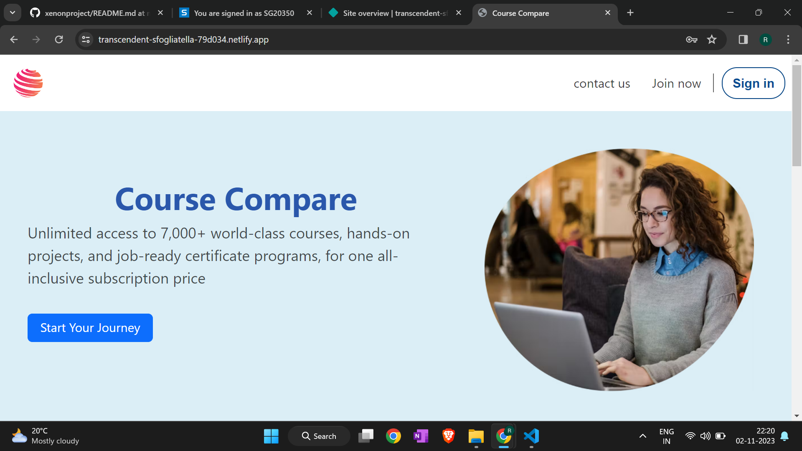
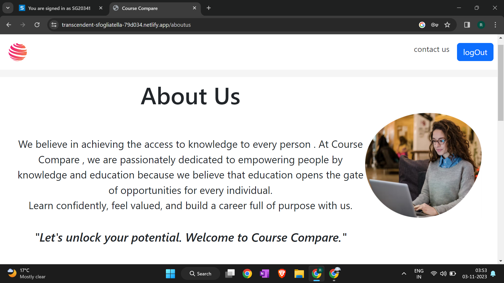
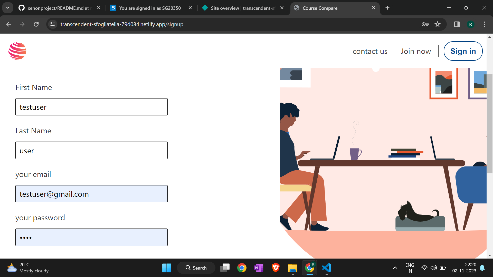
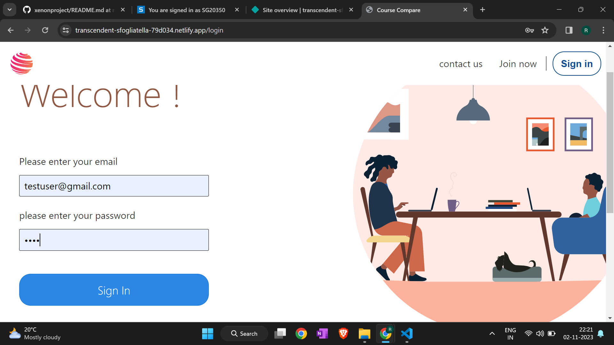
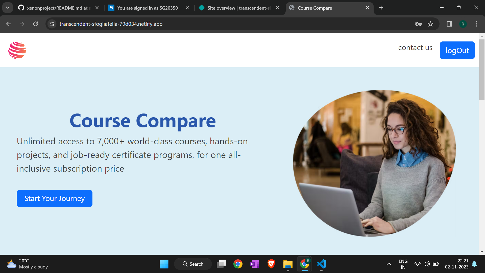
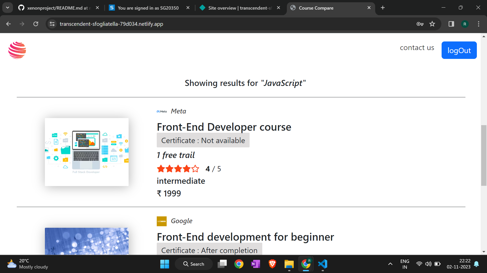
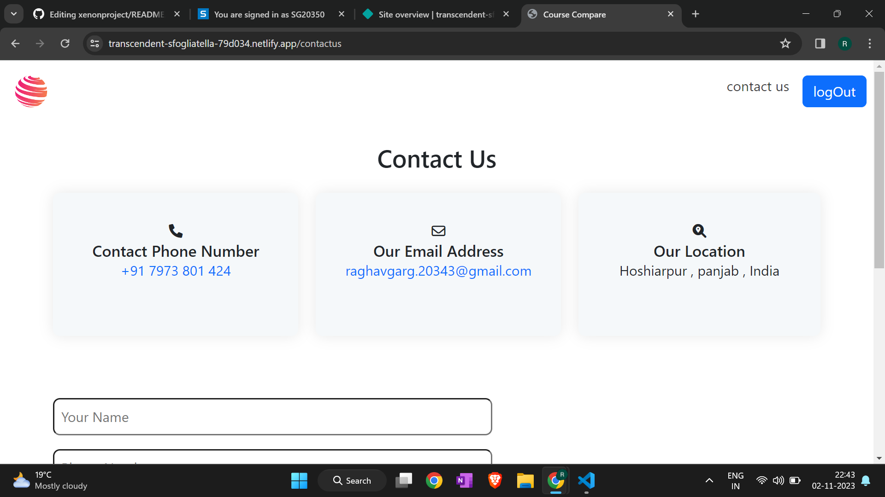

# XenonProject (https://transcendent-sfogliatella-79d034.netlify.app/)

## Description

XenonProject is a user-friendly web application designed to help both instructors and learners connect in a seamless educational environment. With a clean and intuitive interface, Learnify offers a straightforward platform for instructors to showcase their courses and for learners to discover and enroll in their preferred subjects.

## Table of Contents

- [Features](#features)
- [Technology Used](technology-used)
- [File Structure](#file-structure)
- [Installation](#installation)
- [Testuser](#testuser)
- [Usage](#usage)
- [License](#license)

## Features

**User Authentication and Registration:**
- User accounts with unique usernames and passwords.
- Options for users to register using email, social media accounts, or other authentication methods.

**Course Catalog:**
- A searchable and categorized list of available courses presented with clear titles, descriptions, and instructor details.
- Filter options for sorting by subject, level, duration, etc.
- Engage with comprehensive course overviews, including curriculum, prerequisites, and user reviews

**Content Recommendations:**
- Personalized course recommendations based on user preferences, browsing history, and behavior.

**Admin Dashboard:**
- Backend interface for administrators to manage users, courses, content, and settings.

## Technologies Used
**Frontend:**
- React.js
- CSS for styling
  
**Backend:**
- Node.js
- Express.js
- MongoDB

**Additional Libraries:**
- Axios for HTTP requests
- React Router for client-side routing
  
## File Structure

- frontend/: Frontend codebase.
- backend/: Backend codebase.
- frontend/public/: Static assets.
- frontend/src/: React components and application logic.
- backend/config/: Configuration files.
- backend/controllers/: Controllers for handling routes.
- backend/models/: Mongoose models for MongoDB.
- backend/routes/: Express.js route definitions.
- package.json: Project configuration and dependencies.
- README.md: Project documentation.

## Installation

**1. Clone the repository:**
git clone https://github.com/RaghavGarg-16/xenonproject.git

**2. Navigate to the project directory:**
cd xenonproject

**3. Install dependencies for both backend and frontend:**
cd backend && npm install
cd ../frontend && npm install

**4. Set up MongoDB:**
Install and start MongoDB locally or set up a remote MongoDB instance.

**5. Create a .env file in the server directory and add the following variables:**
MONGO_URI=your_mongo_uri
JWT_SECRET=your_jwt_secret

**6. Start the server and client:**
cd server && npm start
cd ../client && npm start

**The app will be running on http://localhost:3000.**

## Test user

**email** : testuser@gmail.com  
**password** : test

## Usage
### Home Page

### About Page

### Sign Up page

### Sign in page

### Logged in Home Page

### Course Cards

### Contact us page

  
## License
This project is licensed under the [MIT License](MIT-License).

